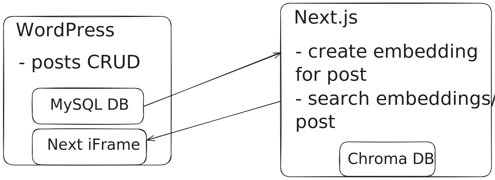

## Project

CMS that includes semantic search via LLM.

Still work in progress

## Features

- dockered WordPress
- next.js UI that renders as iframe in WordPress
- next.js use cases:
  - create embedding for post
  - search all posts and return post link

## Overview

## Setup

- start services w/ docker compose up
- set up WordPress with wizard (port 8080)
- create site and embed next.js app in WordPress, if localhost: '<iframe src="http://localhost:3000" width="100%" height="600" style="border:none;"></iframe>'
- tunnel next aapp w/ e.g. ngrok (port 3000)
- install WP Webhooks and add webhook on post create to NEXT_APP/api/add-post
